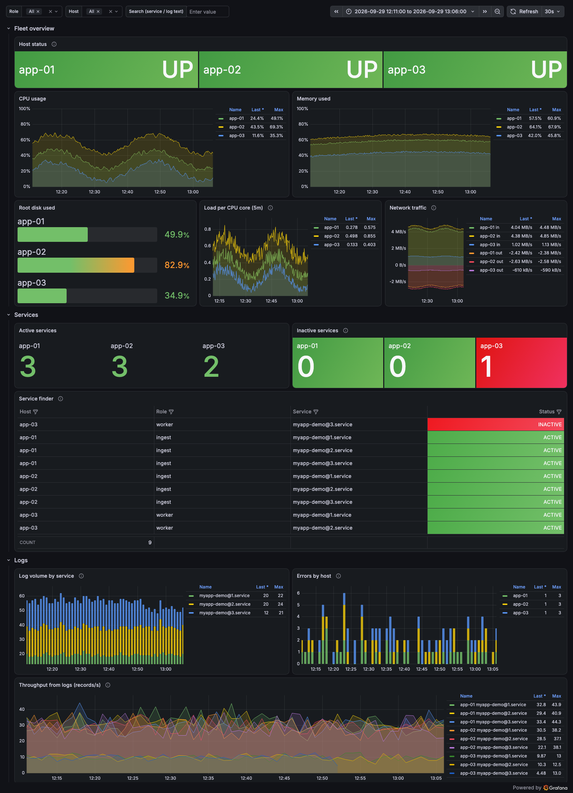

# Pipeline Observability: Grafana, Prometheus, Loki

A small, production-style monitoring stack for a fleet of Linux servers that run
data-pipeline services (ingest workers, forwarders, consumers). One dashboard gives
you three views:

- **Is each host healthy?** CPU, memory, disk, load and network, per host.
- **Are my services running?** Every watched systemd unit, active or inactive, with a search box.
- **What are they saying?** Filtered logs, error counts, and throughput numbers pulled out of log lines.



```
   Monitored hosts (any number)                      Monitoring server (Docker Compose)
 ┌──────────────────────────────┐                ┌──────────────────────────────────────┐
 │ node_exporter :9100 ◄────────┼── scrape 15s ──┤ Prometheus :9090  (metrics, 15d)     │
 │   host + systemd unit state  │                │                                      │
 │                              │                │ Loki :3100        (logs, 7d)         │
 │ Grafana Alloy ───────────────┼── push logs ──►│                                      │
 │   journald → filter → Loki   │                │ Grafana :3000     (dashboard)        │
 │   (drops noise at the source)│                │   ├─ datasources: provisioned        │
 └──────────────────────────────┘                │   └─ dashboard:   provisioned        │
                                                 └──────────────────────────────────────┘
```

Everything is config-as-code: datasources, dashboard, alert rules and host inventory
live in this repo, so a fresh server comes up complete with `docker compose up -d`.

## Quick start

```bash
git clone https://github.com/narkhedeakshay26/pipeline-observability.git
cd pipeline-observability

# 1. Add your hosts (name, IP, role)
cp inventory/hosts.example.txt inventory/hosts.txt
vi inventory/hosts.txt

# 2. Settings (set a real Grafana password)
cp .env.example .env
vi .env

# 3. Start the central stack on the monitoring server
./scripts/render-targets.sh
docker compose up -d

# 4. Install agents on every host (over SSH, needs sudo there)
LOKI_URL=http://<monitoring-server-ip>:3100/loki/api/v1/push ./scripts/deploy-agents.sh

# 5. Check
./scripts/check-stack.sh <monitoring-server-ip>
# open http://<monitoring-server-ip>:3000 → Dashboards → Pipeline Observability
```

The full walkthrough, covering firewall ports, a test service, troubleshooting and
hardening, is in **[docs/GUIDE.md](docs/GUIDE.md)**.

## What's in the repo

| Path | What it is |
|---|---|
| `inventory/hosts.example.txt` | **Where your IPs go.** One line per host: `name ip role` |
| `.env.example` | Versions, ports, Grafana admin login, Prometheus retention |
| `docker-compose.yml` | Prometheus + Loki + Grafana |
| `prometheus/prometheus.yml` | Scrape config. Hosts come from `targets/` (file-based discovery) |
| `prometheus/rules/host-alerts.yml` | HostDown, disk almost full, high load, service inactive |
| `loki/loki-config.yml` | Single-node Loki, filesystem storage, 7-day retention |
| `grafana/provisioning/` | Datasources and dashboard provider, loaded at start-up |
| `grafana/dashboards/pipeline-observability.json` | The dashboard |
| `agent/alloy/config.alloy` | Log agent: journald → keep selected units → drop noise → Loki |
| `agent/node_exporter/node_exporter.service` | Metrics agent systemd unit (with the systemd collector) |
| `scripts/render-targets.sh` | Inventory → Prometheus targets file |
| `scripts/install-agent.sh` | Installs both agents on one host (checksum-verified, re-runnable) |
| `scripts/deploy-agents.sh` | Runs the installer on every inventory host over SSH (jump hosts supported) |
| `scripts/check-stack.sh` | One-command health check |
| `examples/demo-service/` | Fake `myapp-demo@N` workers so you can see the dashboard working |
| `docs/` | Guide, query cheat sheet, lessons learned |

## Design choices

- **Filter logs on the host, not in Loki.** Per-message debug lines and full payload
  dumps are dropped by Alloy before they leave the machine. That saves bandwidth and
  storage, and keeps personal data out of your log store.
- **One `host` label everywhere.** Prometheus targets and log streams carry the same
  `host` value from the inventory, so one dashboard variable filters both metrics and logs.
- **Service state comes from node_exporter's systemd collector**, not from the logs.
  A crashed service stops logging, so an empty log panel can't tell you whether a
  service is dead or just quiet. `node_systemd_unit_state` can.
- **Grafana Alloy, not Promtail.** Promtail is end-of-life. Alloy is its supported
  replacement and reads the journal natively.
- **Pinned versions** in `.env`. Upgrades are a deliberate one-line change.

Tested with Prometheus v3.15.0, Loki 3.7.8, Grafana 13.2.3, Alloy v1.20.1 and node_exporter v1.12.1.

## Screenshot


_Three demo hosts running the bundled `myapp-demo@N` workers, with `myapp-demo@3` on
`app-03` stopped so the Inactive services and Service finder panels show it._

## License

MIT, see [LICENSE](LICENSE).
